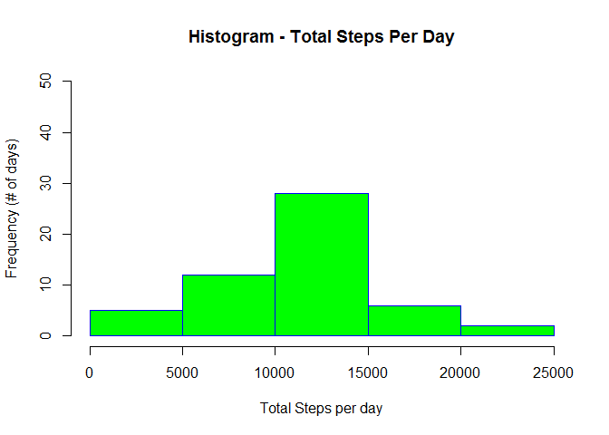

# Reproducible Research: Peer Assessment 1
January 8, 2016  


## Loading and preprocessing the data

```r
activity.raw<-read.csv("activity.csv")
#inspect data check for NA in each columns
##unique(activity.raw$steps)
##unique(activity.raw$date)
##unique(activity.raw$interval)

#remove NA
activity.ignoreNA<-activity.raw[!is.na(activity.raw$steps),]
```

## What is mean total number of steps taken per day?

```r
#calculate the total steps per day
stepsPerDay<-aggregate(steps~date, sum, data=activity.ignoreNA)
hist(stepsPerDay$steps,main="Histogram - Total Steps Per Day", 
     xlab="Total Steps per day", 
     ylab="Frequency (# of days)",
     border="blue", 
     col="green",ylim=c(0,50))
```

\


###Mean and Median of Total Steps Per Day

```r
mean(stepsPerDay$steps)
```

```
## [1] 10766.19
```

```r
median(stepsPerDay$steps)
```

```
## [1] 10765
```


## What is the average daily activity pattern?

```r
dailyPattern<-aggregate(steps~interval, mean,data=activity.ignoreNA)

plot(dailyPattern$interval, dailyPattern$steps, xlab="5 minutes interval in a day",ylab = 'Average Steps',main="Daily Activity Pattern",type="l",xlim=c(0,2355))
```

\


### Most Active Time in a Day

```r
dailyPattern[dailyPattern$steps==max(dailyPattern$steps), ]$interval
```

```
## [1] 835
```
## Imputing missing values
1. Calculating number of rows with missing values (NA).

```r
nrow(activity.raw[is.na(activity.raw$steps),])
```

```
## [1] 2304
```
2. Obtain the median of the 5 minutes interval (mean of steps recorded the same time interval every day)

```r
meanSteps<-aggregate(steps~interval, mean, data=activity.ignoreNA)
```
3.Use the Mean of steps in 5 minutes interval to replace NA in original data set using time interval as look up key.

```r
activity.rawMean<-merge(activity.raw,meanSteps,by.x="interval",by.y="interval")
activity.rawMean$steps.y<-round(activity.rawMean$steps.y,digits=0)
#construct the tidy data set - interval, date, steps
activity.tidy<-within(activity.rawMean, steps<-ifelse(is.na(steps.x),steps.y,steps.x))[,c(1,3,5)]
```
4. Imputed Data - Histogram and Mean and Median

```r
#calculate the total steps per day
stepsPerDayTidy<-aggregate(steps~date, sum, data=activity.tidy)
hist(stepsPerDayTidy$steps,main="Overlapping Histogram (Imputed vs NA_Ignored) - Total Steps Per Day", 
     xlab="Total Steps per day", 
     ylab="Frequency (# of days)",
     col="red",ylim=c(0,50))
hist(stepsPerDay$steps, 
     xlab="Total Steps per day", 
     ylab="Frequency (# of days)",
     col="green",ylim=c(0,50),add=T)
legend("topright", c("NA-Ignored", "NA-Imputed with Mean"), col=c("green", "red"), lwd=10)
```

\


### imputed mean  

```r
round(mean(stepsPerDayTidy$steps), digits=0)
```

```
## [1] 10766
```
### imputed median  

```r
round(median(stepsPerDayTidy$steps), digits=0)
```

```
## [1] 10762
```
### As shown in the overlapping historgram (red portion), more days with steps ranged 10000 to 15000 are found after NA got imputed.  The mean and median based on the imputed data are very close to the data set where NA got ignored.

## Are there differences in activity patterns between weekdays and weekends?

```r
#identify weekend and weekdays
activity.tidy$DayType<-ifelse(weekdays(as.Date(activity.tidy$date))%in% c("Sunday", "Saturday"), "Weekend", "Weekday")
activity.tidy$DayType<-as.factor(activity.tidy$DayType)
#average steps per interval, seperated by weekend and weekdays
avgStepsByInterval<-aggregate(steps~interval+DayType, mean,data=activity.tidy)
library(ggplot2) 
```

```
## Warning: package 'ggplot2' was built under R version 3.2.3
```

```r
qplot(interval, steps, data = avgStepsByInterval, geom = 'line',facets = DayType~., main="Average Steps Per Interval - Weekend vs Weekday")
```

\

